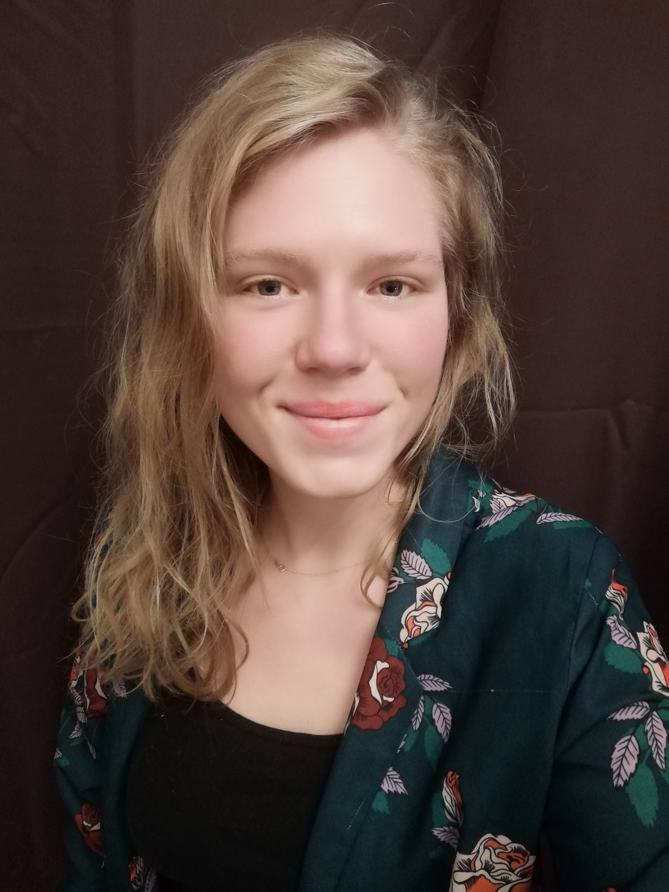

# Stephanie Van Bockhaven

*"Remember that when it's raining, most of the rain falls beside you."*

### "Multipontentionalist at heart"
Birthday | Favorite color | Favorite food | Pineapple on pizza
--- | --- | --- | ---
18/08/1988 | Depends on the moment | Mediteranean | &#9746; -[x] Yes &#9744; -[] No

### Hobbies
+ Building things
    + Renovating my home
    + Helping out clumsy friends
    + Making usefull objects
+ Arts
    + Reading books and interesting articles
    + Listening to music
    + Watching movies
    + Visiting musea
+ Wellness retreat
### You can always count on me when...
... you're in need of a listening ear, help, a dt-mistake finder, a fun night out chatting or dancing.

### A funny story
When I was 11, my sisters and some of my brothers have passed the age of 18. So they had to take exams to get their drivers license. All of them so far had failed the first time of the practical part, costing my parents a lot of money. My dad was so fed up with this, he started teaching me and my youngest brother to drive the car. We learnt it on a big meadow behind our home. I could brag to all of my friends that I already knew how to drive and also I was the only one of all of my siblings to pass the exam from the first time on.

#### TL;DR
I learnt driving a car at age 11, because my dad was so traumatized by the fact my sisters had to do their driving exams a couple of times over.

<< [previous](https://github.com "Selin") || Stephanie Van Bockhaven || [next](https://github.com "Valerie")>>